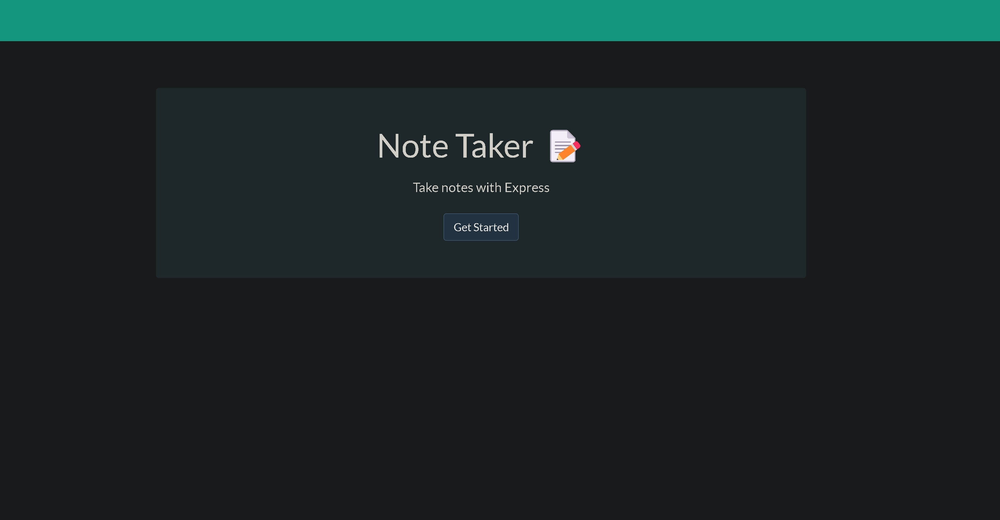

# Note-taker

<div id="top"></div>

Use `Note_Taker` to uickly record and save notes or create a TODO list.

## __Table of Contents__
- [Note_Taker](#bote_taker)<br>
- [Installation](#installation)<br>
- [Screenshots](#screenshots)<br>
- [Usage](#usage)<br>
- [Credit](#credit)<br>
- [Contact Me](#contact-me)<br>
- [License](#license)<br>

## Installation 

Note_Taker deployed on <u><i>**Heroku**</i></u>.

To download locally to machine:
<br>
1️⃣ Verify that `Node.JS` is installed on your machine. To verify, open a terminal - type `node -v` into the prompt and press enter. To install Node.JS, [click here](https://nodejs.org/en/) <br>

2️⃣ Clone the repository using HTTPS, under "Clone with HTTPS", click . To clone the repository using an SSH key, including a certificate issued by your organization's SSH certificate authority, click Use SSH, then click . To clone a repository using GitHub CLI, click Use GitHub CLI, then click .<br>

3️⃣ Open Git Bash and navigate to the location you want the cloned directory.

  * Type `git clone`, then past the URL you copied.

	```
	$ git clone https://github.com/YOUR-USERNAME/YOUR-REPOSITORY

	```
  * press enter to create your local clone

	```
	$ git clone https://github.com/YOUR-USERNAME/YOUR-REPOSITORY
	> Cloning into `Spoon-Knife`...
	> remote: Counting objects: 10, done.
	> remote: Compressing objects: 100% (8/8), done.
	> remove: Total 10 (delta 1), reused 10 (delta 1)
	> Unpacking objects: 100% (10/10), done.
	```

  * change into local clone and open in VS code (or other IDE)

	```
	$ cd Note_Taker
	$ code .
	```

4️⃣ Open a new terminal and run
	`node server.js`

5️⃣ Open your internet browser and search URL `localhost:3001/`

<p align="right">(<a href="#top">back to top</a>)</p>

## Screenshots
<br>
<br><br><br>
.jpg)<br>

<p align="right">(<a href="#top">back to top</a>)</p>

## Usage

Note_Taker is divided in columns: writing and editing notes is done in the right column and a viewable list of saved notes is displayed in the left column. Notes are filtered in the order in which they are written. Click any note in the list to view, edit, or delete or create new note by typing in text area and clicking the save icon. 

<p align="right">(<a href="#top">back to top</a>)</p>

## Web Technologies
| Technology | URL | 
| :---: | :----: |  
| HTML  | [HTML](www.html.com) |
| CSS  | [HTML](www.html.com) |
| Bootstrap | [HTML](www.html.com) |
| NodeJS | [HTML](www.html.com) |
| ExpressJS | [HTML](www.html.com) |
| NoS | [HTML](www.html.com) |

## Credit
[Damien Luzzo](https://www.github.com/damienluzzo33) - For helping me change direction on the way I was setting up my routes.

## Contact Me
📧 [Email](https://www.vlsulliv@yahoo.com)<br>
📝 [Slack](https://stackoverflow.com/users/13850481/vlsulliv)<br>
🔗 [linkedIn](https://www.linkedin.com/in/vlsullivan/)<br>
🖥️ [GitHub](https://www.github.com/vlsulliv)<br>

## License
<p align="right">(<a href="#top">back to top</a>)</p>

This work licensed under the [MIT](https://choosealicense.com/licenses/mit/) license<br>
[](https://opensource.org/licenses/MIT)

<br>
<p align="right">(<a href="#top">back to top</a>)</p>

---
Project By: Vincent Sullivan ✌️🐢